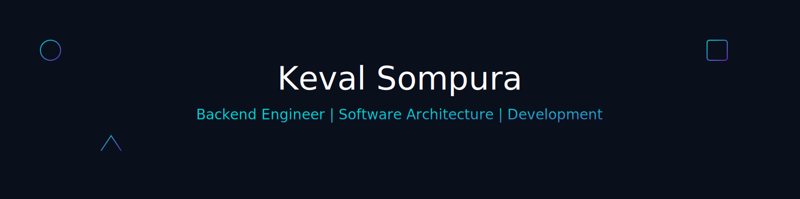

</img>

### :space_invader: &nbsp;About Me

&nbsp;&nbsp;&nbsp;:technologist: &nbsp; Graduate student at Stevens Institute of Technology, pursuing M.S. in Computer Science. \
&nbsp;&nbsp;&nbsp;:satellite: &nbsp; Former Senior Software Engineer at Lentra, building scalable fintech solutions. \
&nbsp;&nbsp;&nbsp;:dart: &nbsp;Focused on backend engineering, system design, and cloud infrastructure.\
&nbsp;&nbsp;&nbsp;:writing_hand: &nbsp;Currently exploring advanced topics in concurrency, web systems, and System Designs.\
&nbsp;&nbsp;&nbsp;:coffee: &nbsp;Always up for a good challenge—and strong coffee.

  &nbsp;&nbsp;&nbsp;&nbsp;

  
<b>💻 &nbsp;Tech Stack & Skills</b>

   

### 🧠 Programming Languages

### 🚀 Frameworks & Libraries

### 🗃️ Databases

### 🔧 Tools & DevOps

### ☁️ Cloud & Infrastructure

### 📦 Build Tools

### 🔌 APIs & Protocols

### 💻 Operating Systems & IDEs

### 🏛️ Architecture & Methodologies

